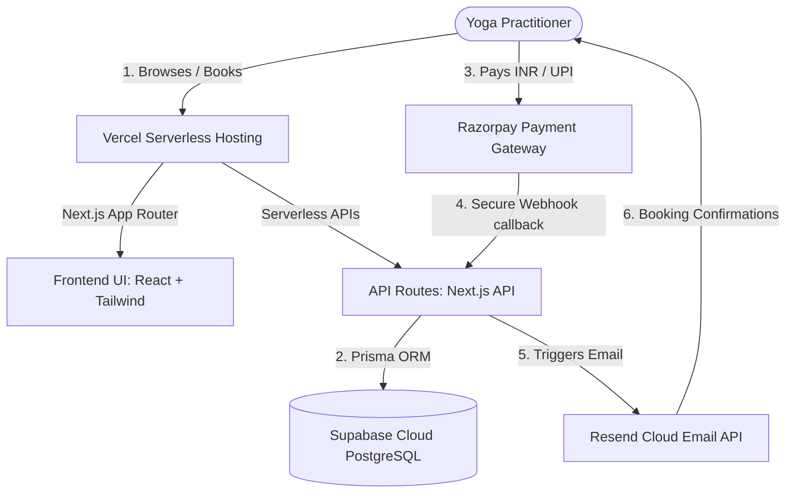

# Cloud-First Roadmap: "Yog with Dhaarna" Booking Platform

To completely eliminate the need for local machine execution (no local database installation, no local running servers, no local tunnel setup), we are transitioning from a divided React+Express stack to a **unified Next.js (App Router) + Supabase + Vercel** cloud-first architecture. 

This plan ensures that **100% of the database, hosting, preview deployments, and payment testing operate in the cloud from Day 1**.

---

## Architecture Blueprint (Cloud-First Stack)

### Why This Stack Suits the "No Local Execution" Goal:
1. **Zero Database Setup:** Supabase provides a hosted cloud-based PostgreSQL database instantly. We connect to it directly via secure connection strings from Vercel and Prisma.
2. **Deploy Previews on Every Push:** Vercel builds the code in the cloud. Every single Git commit generates a unique `https://...` preview URL automatically. The user and developers can test all features (including calendar flows and forms) entirely in the browser.
3. **Seamless Webhook Testing:** Because the Vercel preview deployments are public URLs, Razorpay webhooks can send real-time events (payment success, failure) straight to the cloud API without requiring local tunneling tools like `ngrok`.
4. **Instant Production Launch:** Once testing is complete on the preview branch, promoting the site to the live domain `yogwithdhaarna.com` is a single click on Vercel.

---

## User Review Required

> [!IMPORTANT]
> **Cloud Provisioning Requirements:** To execute this roadmap without local execution, we will need to set up free-tier accounts on the following platforms. We will guide you through getting their credentials:
> 1. **Vercel** (For frontend + serverless backend hosting)
> 2. **Supabase** (For the hosted PostgreSQL database)
> 3. **Razorpay** (For payment gateway keys - Test mode active instantly, Live mode requires business registration documents)
> 4. **Resend / Twilio SendGrid** (For sending the class transactional confirmation emails)

---

## 4-Week Cloud Roadmap & Execution Plan

### Phase 1: Cloud Infrastructure & Scaffold (Days 1 - 5)
*   **Goal:** Scaffold a clean Next.js template, link it to Supabase and Vercel, and verify the live dev URL.
*   **Proposed Tasks:**
    *   Initialize Next.js 14+ (App Router) project with Tailwind CSS.
    *   Set up Prisma ORM configured to point directly to the remote cloud Supabase PostgreSQL database.
    *   Define the core schema: `User`, `Class`, `Booking`, `TimeSlot`.
    *   Run initial migration directly on the cloud database and seed 6 mock classes (e.g., Vinyasa Flow, Hatha, Meditation).
    *   Deploy the initial build to Vercel and verify the live connection to the cloud database.

### Phase 2: Premium Responsive UI & Booking Calendar (Days 6 - 12)
*   **Goal:** Build a gorgeous, fast, and SEO-optimized frontend that displays live booking slots.
*   **Proposed Tasks:**
    *   Implement premium styling using HSL-tailored dark/light theme, modern typography (Inter/Outfit), and subtle micro-animations for hover states.
    *   Create a dynamic booking calendar (using `date-fns`) that fetches real-time `TimeSlot` availability from the cloud database via Next.js Server Actions or API routes.
    *   Build responsive pages:
        *   `Home` (Hero section, client testimonials, about Dhaarna).
        *   `Classes` (Detailed class types, levels, durations, pricing).
        *   `Book` (Interactive slot picker and customer info form).
        *   `Contact` (Enquiry form).
    *   Deploy all frontend components to Vercel preview environments.

### Phase 3: Booking Concurrency & Admin Control (Days 13 - 19)
*   **Goal:** Protect against double-bookings and provide Dhaarna with an online dashboard.
*   **Proposed Tasks:**
    *   Write robust Prisma interactive transactions to handle slot inventory changes safely when multiple users try to check out at once.
    *   Build a secure, authenticated `/admin` portal (protected by secure cookies/Next-Auth) where Dhaarna can:
        *   View real-time booking lists and customer details.
        *   Approve, cancel, or reschedule bookings.
        *   Add new classes and open new calendar time slots dynamically.
    *   Verify the admin flow in the cloud preview.

### Phase 4: Razorpay Cloud Webhooks & Emails (Days 20 - 28)
*   **Goal:** Integrate live checkout payments, email notifications, and optimize SEO before launch.
*   **Proposed Tasks:**
    *   Integrate Razorpay SDK checkout flow in the frontend.
    *   Write the secure POST `/api/webhooks/razorpay` endpoint to receive checkout event success updates.
    *   Set up Resend/SMTP to trigger professional transactional emails to both Dhaarna and the customer with class details and Google Meet/Zoom links upon successful payment.
    *   Implement SEO essentials (metadata tags, OpenGraph images, and dynamic sitemaps for Google indexing).
    *   Finalize manual end-to-end testing directly on the Vercel staging deployment and switch to production.

---

## Verification Plan

### Staging Verification
*   Every commit will be pushed to the repository, trigger a Vercel Cloud build, and generate a secure staging URL.
*   We will test form inputs, mobile responsiveness, calendar slot fetches, and API database reads/writes directly on the cloud staging website.

### Integration Testing (Cloud Payments)
*   We will set up Razorpay in **Test Mode** on the cloud deployment.
*   We will execute the complete booking flow, verify that the mock payment triggers the Vercel webhook successfully, writes to the Supabase database, and delivers a test email using Resend.
